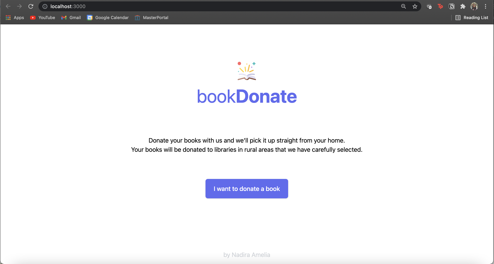
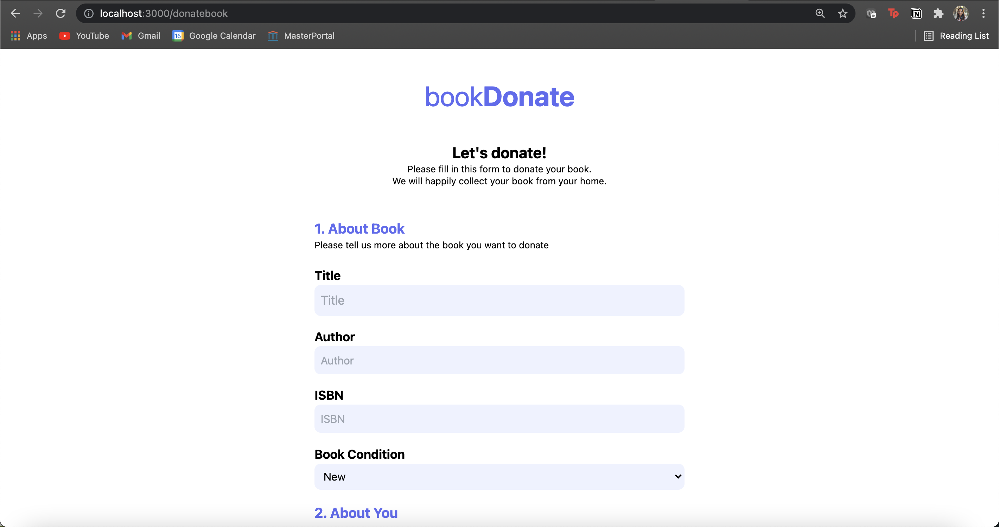
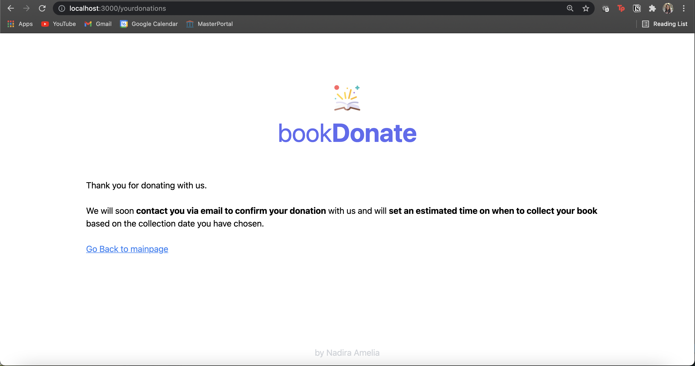

# uiuxAssignment3
This is an assignment for the UIUX and Web Development module at Universitas Gadjah Mada on the first semester of the 2021/2022 Academic Year.

The code file is in the master branch, along with how to run it locally on the computer. The project itself started by having an idea to make a platform for donating books online, and that the books will be collected by the company that I call "donateBook". After creating the idea, I made a high fidelity prototype which can be seen here. https://xd.adobe.com/view/7bef83af-b75e-4b1b-a63a-a02b73533079-2ebc/

The main features that were planned are:
1. Donate a book form
2. track donation progress

The design has been changed as there wasn't enough time. The feature of "track donation progress" is not implemented.

This project uses TailwindCSS, ReactJS, and Firebase Firestore.
# Home Page

# Donate Form Page
 
# Successfully Sent Form Page
 

